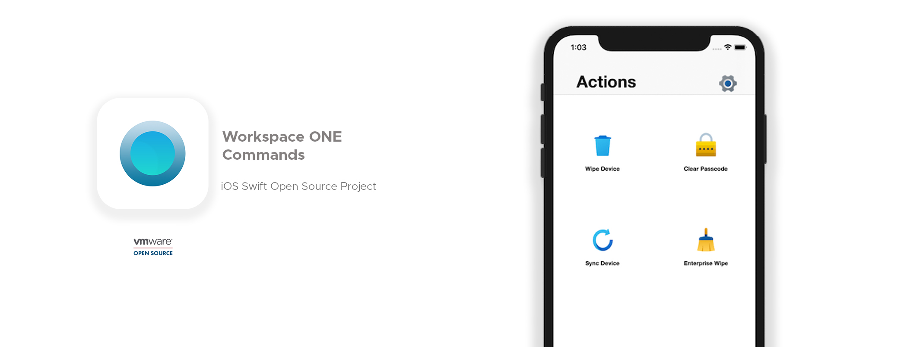

# Workspace ONE Commands for iOS

## What is it?

Workspace ONE Commands is an open source iOS swift project that provides enterprise IT admins to easily customize, build and deploy an IT focussed iOS application purpose built to perform on-demand MDM actions such as Device Wipe, Enterprise Wipe, and Clear Passcode on their own device.  The application can be entirely customized using Application Configuration to choose which actions to show in the app. 

Each of the commands available in the App are APIs as part of the Workspace ONE UEM solution. App config values configure the corresponding command to be made visible in the App UI

The simple user interface with a grid of actions keeps it extremely simple for users to launch the app and tap the button.

## Why is it available as Open-Source?

We believe this iOS project can truly harness the power of Workspace ONE UEM APIs and open doors for innovate line of business workflows. And ofcourse, it was a pretty simple app. 

*  Branding :  One of the advantages of providing the source code for the project is that it allows any organization to rename, brand and customize the application icon with their logo for easy discovery and familiarity

*  Extensibility and community: The open source project gives the opportunity for any organization to fork, and add any more features to the app as necessary. It preferred we encourage raising a Pull Request to add any new features that others may also benefit from. 

## How to deploy the app?

The source code can be signed and compiled with an Apple Enterprise Developer Account, that allows for distribution through couple different methods : 

1) Enterprise App Distribution : The archive (.ipa) built with Enterprise Developer account along with a *provisioning profile* can be uploaded to Workspace ONE UEM console and assigned to devices using smart groups. For more information on deploying enterprise apps with Workspace ONE UEM [refer this document](https://docs.vmware.com/en/VMware-Workspace-ONE-UEM/1811/VMware-Workspace-ONE-UEM-Mobile-Application-Management/GUID-AWT-CONFIG-INTERNAL-APPS-LOCAL.html).

2) Custom App : Deploying as a Custom App with the help of Apple Business Manager will be the most preferred method going forward. For more information on Custom Apps check [this Techzone tutorial](https://techzone.vmware.com/managing-ios-custom-apps-vmware-workspace-one-operational-tutorial).  The Application Configuration keys described above can be added to the app deployment during the assignment phase, as outlined in Step 8 of the [Assigning Custom Apps to Devices](https://techzone.vmware.com/managing-ios-custom-apps-vmware-workspace-one-operational-tutorial#1249320) section.

## How to configure the app?

*Pre-requisites*
* Access to Workspace ONE UEM console
* API service account (needed as input in Appconfig below)
* API token (needed as input in AppConfig below)

When deploying the app to devices, use the following values in the Application Configuration section to configure the app appropriately:

| Key | Type | Requirement | Function |
| --- | --- | ---| --- |
| DEVICE_UID | string | Required| Set to {DeviceUid} |
| API_HOSTNAME | string | Required |The API URL for the WS1 UEM environment.  Use the form https://apiurl.com/api |
| API_KEY | string | Required |The REST API key configured in your WS1 UEM Organization Group |
| API_USERNAME | string | Required | The username of a WS1 UEM administrator account that has the appropriate permissions to perform the specified actions.  By default you can use an administrator account with the "Console Administrator" role. |
| API_PASSWORD | string  | Required | The password to the WS1 UEM administrator account specified above |
| ENABLE_TROUBLESHOOTING | bool | Optional | If set to true, will enable a Troubleshooting menu within WS1 Actions where the user can see all applied configurations and API information.  Set to false by default. |
| ACTION_WIPE | bool | Optional | If set to true, enables the "Device Wipe" action.  Set to false by default. |
|ACTION_ENTERPRISEWIPE | bool | Optional | If set to true, enables the "Enterprise Wipe" action.  Set to false by default. |
| ACTION_CLEARPASSCODE | bool | Optional | If set to true, enables the "Clear Passcode" action.  Set to false by default. |
| ACTION_SYNC | bool | Optional | If set to true, enables the "Device Sync" action.  Set to false by default. |

## Support
Workspace ONE Commands for iOS project is released as open source software and, presently, provides community support through our GitHub project page and comes with no commercial support. If you encounter an issue or have a question, feel free to reach out via GitHub issues

## Contributing
The Workspace ONE Commands for iOS project team welcomes contributions from the community. If you wish to contribute code and you have not signed our contributor license agreement (CLA), our bot will update the issue when you open a Pull Request.

